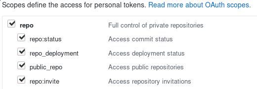

# Github provider 

Github provider uses the Github API to fetch data. You don't have to clone the repository locally.

It requires a **github token** to query the API

## Authentication

Create a Github access token with at least the following scopes:




Then use this token using the option
```
nextver --github-token=xxxxxxxxx ...
```
or exporting the environment variable
```
export GITHUB_TOKEN=xxxxxxxxx
```

Nextver will also use the [hub](https://github.com/github/hub) configuration file if it exists (default location: ~/.config/hub). 

Resolution order is as follow: *parameter* > *environment variable* > *configuration file*

Parameter will take priority 
